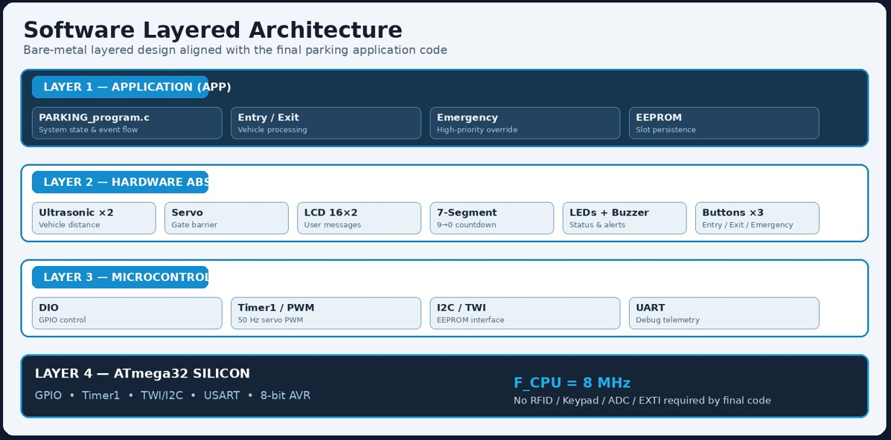
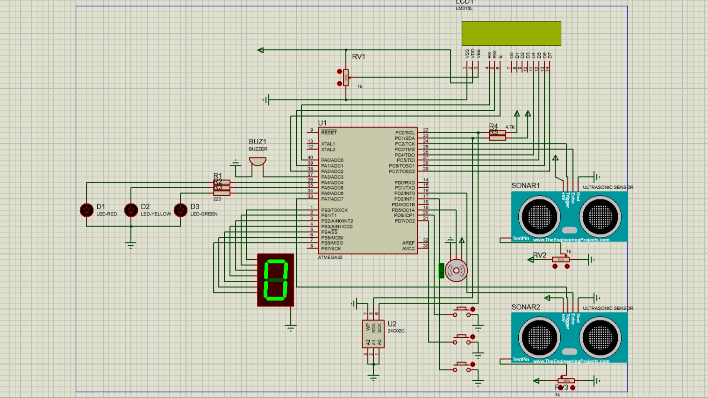
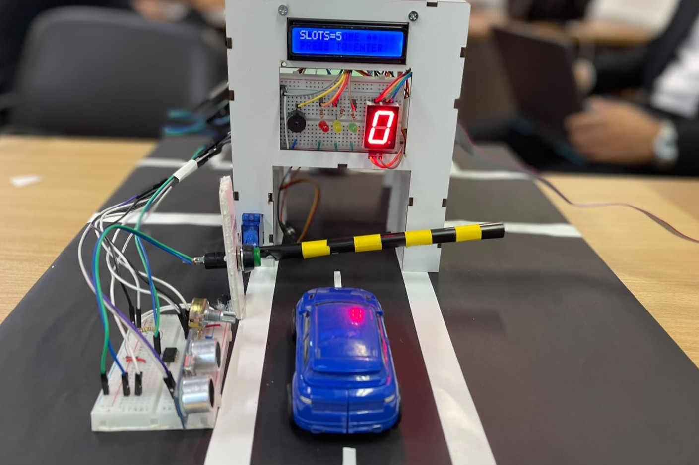
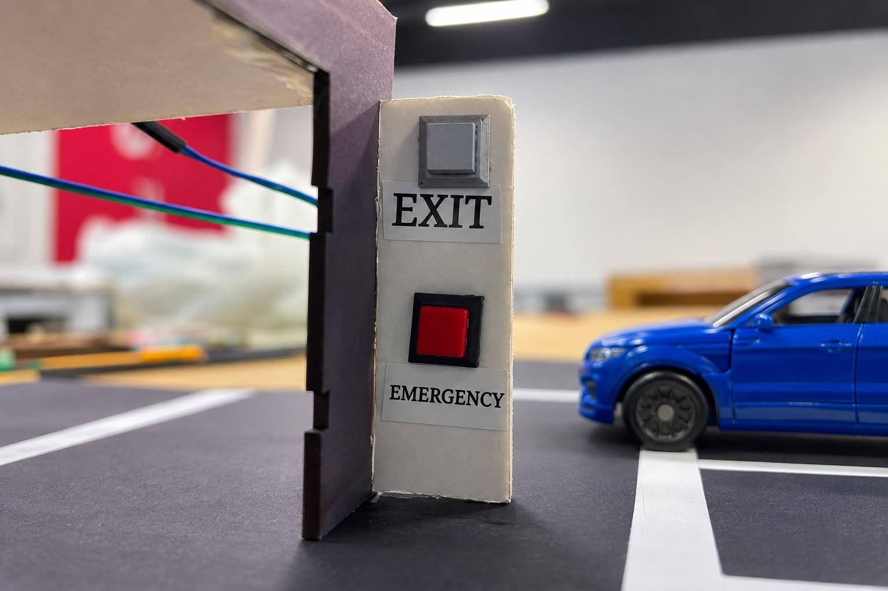
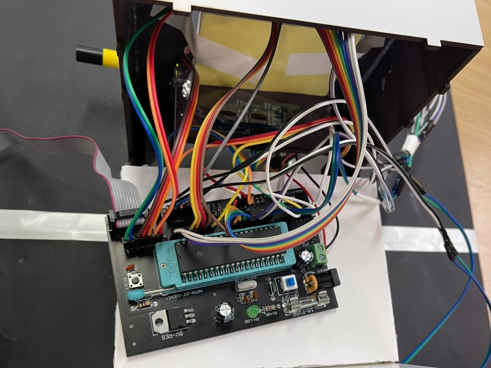

# 🚗 Smart Parking System — ATmega32 Embedded Project

)

An automated, robust **Embedded Smart Parking System** developed as the final graduation project for the **Information Technology Institute (ITI)** Embedded Systems Training Program. The system manages entry gate access, slot availability tracking with double-verification, emergency override protocols, non-volatile state persistence, and real-time visual/auditory hardware feedback.

---

---

## 📌 Key Features & Highlights

- **🚦 Entry Access Control & Ultrasonic Detection:**
  - Entrance Ultrasonic Sensor detects approaching vehicles and prompts drivers via a 16x2 LCD display (`WELCOME` $\rightarrow$ `PRESS ENTER BUTTON`).
  - Pressing the **Entry Button** triggers a **3-second diagnostic check** (Yellow LED illuminated) to verify slot availability.

- **🛡️ Double-Verification Anti-Cheating / Entry Detection Logic:**
  - Gate servo opens (Green LED ON, LCD displays `GATE OPEN`) and a 7-Segment Display counts down from `9` to `0`.
  - **Secondary Ultrasonic Sensor** mounted above the inner entryway measures overhead height-to-ground distance.
  - If a vehicle physically enters, the distance drop confirms passage $\rightarrow$ Gate closes, slot count decrements.
  - **Timeout Safeguard:** If no vehicle passes through after opening, the system aborts entry, displays `TIME OUT / TRY AGAIN`, resets to `PRESS ENTER BUTTON`, and preserves the existing slot counter.

- **💾 Non-Volatile State Memory (EEPROM Integration):**
  - Current occupied/available slot count is permanently logged into external/internal **EEPROM**.
  - Restores precise slot status instantly upon power loss or system reset.

- **🚨 Emergency Override Protocol:**
  - Dedicated **Emergency Button** triggers immediate evacuation mode.
  - Instantly opens the barrier servo and clears/resets all 5 parking slots.

- **🚫 Full Capacity Management:**
  - When all 5 slots are occupied, the system switches to `FULL` status on the LCD, turns on the **Red Warning LED**, and activates an **Auditory Buzzer**.

---

## 🏗️ Layered Software Architecture

The software is structured following **Layered Embedded C Architecture** (MCAL, HAL, App) to ensure strict modularity, clean hardware abstraction, and ease of porting:

---

## 🔄 System Flowchart & State Logic

 

---

## 🛠️ Hardware Components & Connections

| Component | Quantity | Interface Pin / Protocol | Function |
| :--- | :---: | :--- | :--- |
| **ATmega32 Microcontroller** | 1 | - | System Master Core |
| **Ultrasonic Sensor #1 (HC-SR04)** | 1 | Trigger / Echo Pins | Approach Detection at Outer Gate |
| **Ultrasonic Sensor #2 (HC-SR04)** | 1 | Trigger / Echo Pins | Passage Verification inside Entryway |
| **Servo Motor (SG90)** | 1 | Timer1 PWM (OC1A/OC1B) | Gate Barrier Actuator |
| **16x2 Character LCD** | 1 | 4-Bit / 8-Bit DIO | User Interface & Status Display |
| **7-Segment Display** | 1 | Multiplexed DIO | Gate Pass Timer Countdown (9 to 0) |
| **Status LEDs (Red, Yellow, Green)**| 3 | DIO Outputs | Visual Status Indicators |
| **Buzzer** | 1 | DIO Output | Audio Warning for Full Capacity |
| **Push Buttons** | 3 | External Interrupts / DIO | Entry, Exit, Emergency |
| **24C02 / Internal EEPROM** | 1 | I2C (TWI) / Internal | Slot Counter State Memory |

---

## 📸 Hardware Setup & Demonstration Screenshots

### 1. Circuit Simulation in Proteus 8
Complete functional schematic and logic simulation of ATmega32 drivers and peripherals.

---

### 2. Initial State (Slots = 5)
Initial system bootup showing 5 available slots loaded from EEPROM memory.

---

### 3. Entry & User Interaction Controls
Push button interface for initiating entry request and processing gate diagnostics.

---

### 4. Exit & Emergency Management
Dedicated control interface for vehicle exit and instant evacuation (Emergency Clear).

---

### 5. Physical Hardware Wiring & Interfacing
Real-world physical hardware setup featuring custom breadboard wiring, ATmega32 development board, and sensor mounting.

---

### 6. Software Development in Eclipse
Source code implementation using Eclipse IDE with GCC toolchain.

---

## 📂 Repository Directory Structure
Smart-Parking-System-ATmega32/
├── MCAL/
├── HAL/
│   ├── LCD/
│   ├── ULTRASONIC/
│   ├── SERVO/
│   ├── SEVEN_SEGMENT/
│   └── EEPROM/
├── APP/
│   ├── main.c
│   └── parking_app.c
├── Simulation/
│   └── Smart_Parking_Proteus.pdsprj
├── images/
│   ├── cover_image.jpeg
│   ├── proteus_simulation.png
│   ├── initial_slots_state.jpeg
│   ├── entry_button.jpeg
│   ├── exit_emergency_buttons.jpeg
│   ├── real_hardware_connections.jpeg
│   ├── system_flowchart.jpeg
│   └── software_architecture.jpeg
└── README.md

---

## 👨‍💻 Authors & Acknowledgments

**Ahmed Samir**
**Hana Yasser**
**Mohamed Aboelkasem**
**Rawan Ayman**

*Electronics & Communications Engineering Student*  
*Information Technology Institute (ITI) Summer Program — Final Graduation Project*
