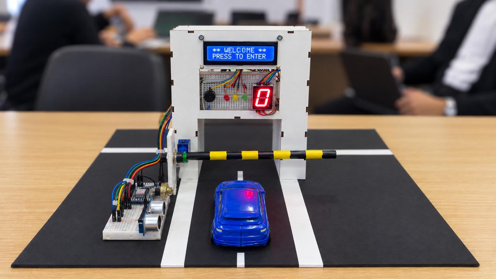
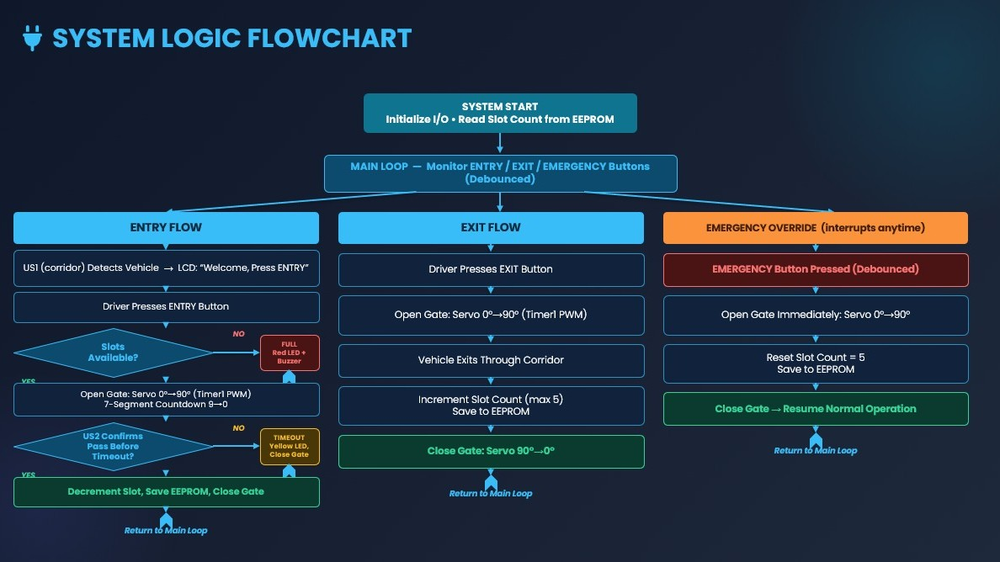

# 🚗 Smart Parking System

> An embedded systems final project built on the **ATmega32** microcontroller, developed as part of the **ITI (Information Technology Institute)** embedded systems track.

---

## 📋 Table of Contents

- [Project Overview](#project-overview)
- [Features](#features)
- [System Flow](#system-flow)
- [Hardware Components](#hardware-components)
- [Pin Configuration](#pin-configuration)
- [Software Architecture](#software-architecture)
- [Proteus Simulation](#proteus-simulation)
- [Real Hardware](#real-hardware)
- [Team](#team)

---

## Project Overview

The Smart Parking System automates gate control and real-time slot management for a 5-slot parking lot. A car approaching the entrance is detected by an ultrasonic sensor; the driver presses a button to request entry, the system checks availability, opens the gate via a servo motor, and confirms the car has actually passed through using a second ultrasonic sensor mounted above the gateway. Slot count is persisted in EEPROM so it survives power cycles.

---

## Features

| Feature | Details |
|---|---|
| 🚘 Car Detection | HC-SR04 ultrasonic sensor detects cars at the entrance (< 20 cm) |
| ✅ Slot Availability Check | 3-second visual check with Yellow LED before opening gate |
| 🚦 Traffic LEDs | Green = available / Yellow = checking / Red = full or denied |
| 🔁 Servo Gate Control | SG90 servo opens and closes the barrier automatically |
| ⏱ 7-Segment Countdown | Counts down 9 → 0 while gate is open |
| 🔍 Entry Confirmation | Second ultrasonic sensor above the gateway confirms the car entered |
| ⏰ Timeout Handling | If car doesn't pass through, shows TIME OUT → TRY AGAIN |
| 🚪 Exit Flow | Exit button opens gate, increments slot count, saves to EEPROM |
| 🚨 Emergency Override | Emergency button opens gate immediately and releases one slot |
| 💾 EEPROM Persistence | Slot count saved to AT24C02 via I²C — survives power loss |
| 📟 UART Logging | All system events streamed to terminal for debugging |

---

## System Flow

### Entry Flow
